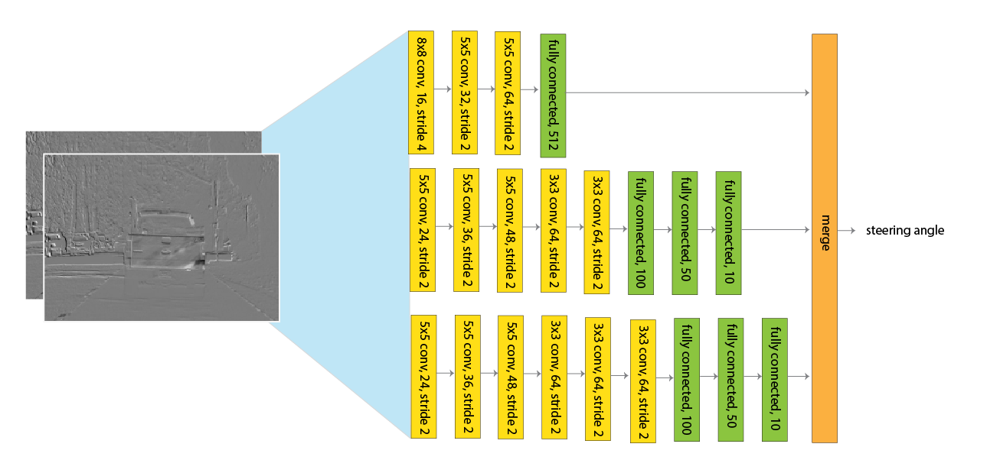
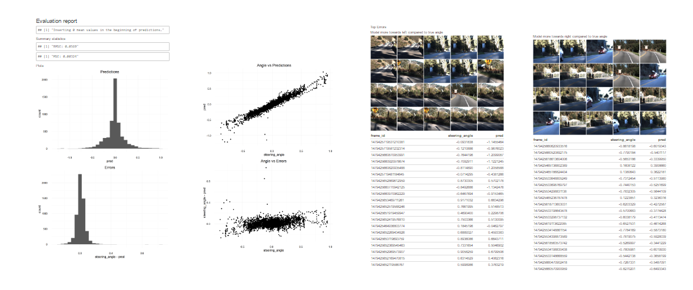

# Udacity Self Driving Car Challenge 2 - Using Deep Learning to Predict Steering Angles

2nd place solution for the [Udacity Self Driving Car Challenge 2](https://medium.com/udacity/challenge-2-using-deep-learning-to-predict-steering-angles-f42004a36ff3).


The overall goal of the [Udacity Self-Driving Car Challenge](https://www.udacity.com/self-driving-car) is to build an open-source self-driving vehicle.
This goal was broken into different challenges. In Challenge 2 your program had to predict steering commands from camera imagery.


# Data

The first phase of the challenge was based on driving data from El Camino Real (small curves, mostly straight driving), 
and the second phase was based on driving data from San Mateo to Half Moon Bay (curvy and highway driving).

* Phase 1 data: [Ch2_001]()
* Phase 2 data: [Ch2_002](https://github.com/udacity/self-driving-car/blob/master/datasets/CH2/Ch2_002.tar.gz.torrent)

The phase 1 data set has PNG images. 
The phase 2 data set is in the ROSBAG format.
We used rwightman's [Udacity Reader docker tool](https://github.com/rwightman/udacity-driving-reader) 
to convert the images into PNGs.

Even though the imagery is from three different cameras (left, center, right), we only used the center images.

The code assumes the following directory structure for data:

```
- models

- round1
-- train
--- 1 
---- center
----- 1477431483393873340.png
----- ...
----- 1477431802438024821.png
--- 2
---- center
----- 1477429515920298589.png
----- ...
----- 1477429548524716563.png
...
--- 21
---- center
----- 1477436619607286002.png
----- ...
----- 1477436971856447647.png
-- test
--- center
---- 1477439402646429224.png
---- ....
---- 1477439732692922522.png

- round2
-- train
--- center
---- 1479424215880976321.jpg
---- ...
---- 1479426572343447996.jpg
-- test
--- center
---- 1479425441182877835.jpg
---- ...
---- 1479425721881751009.jpg
```

Change `data_path` value in `config.py` to point to this data directory.

# Pre-processing

The raw images are of size 640 x 480. In our final model, we resized the images to 256 x 192, converted from RGB color format to grayscale, 
computed lag 1 differences between frames and used 2 consecutive differenced images.
For example, at time t we used [x_{t} - x_{t-1}, x_{t-1} - x_{t-2}] as input where x corresponds to the grayscale image. 
No future frames were used to predict the current steering angle.

To pre-process phase 2 training data, run:

```
python preprocess_train_data.py
```

To pre-process phase 2 test data, run:

```
python preprocess_train_data.py
```

These pre-processing scripts convert image sets to numpy arrays.

# Model

Our final model consisted of 3 streams that we merged at the final layer. 
Two of the streams were inspired by the [NVIDIA's self-driving car paper](https://arxiv.org/abs/1604.07316), 
and one of the streams was inspired by [comma.ai’s steering model](https://github.com/commaai/research/blob/master/train_steering_model.py).



We were surprised that many tricks that work well with classification networks did not transfer over to this regression problem. 
For example, we did not use dropout, batch normalization or VGG-style 3x3 filters. 
It was hard to get the model to predict something other than the average value. 
Of course, there might have been a problem in the hyperparameter selection.

To train different models, run:

```
python train.py
```

You can change these parameters in the `config.py` file:

* `--data` - alias for pre-processed data. There are multiple ways to pre-process the data (how many consecutive frames to use, image size, etc).
This parameter value gives us information what data set to use.
* `--num_channels` - number of channels the data has. For example, if you use 4 consecutive frames, then `num_channels` must be 4.
* `--img_height` - image height in pixels, default is 192.
* `--img_width` - image width in pixels, default is 256.
* `--model` - model definition file, see `models.py` for different models.
* `--test_part` - which part of the data to use as validation set.
* `--batch_size` - minibatch size, default is 32.
* `--num_epoch` - number epochs to train, default is 10.
* `--data_path` - folder path to pre-processed numpy arrays.

To predict steering angles from test data, run:

```
python predict.py
```

# Online predictions and reproducing our results

We have included model checkpoint and 10 sample images from the test set to show how to get real-time predictions. 

When you run

```
python predict_online.py
```

you should get the following output:

```
[-0.00417908]
[-0.00417908]
[-0.06669259]
[-0.02482447]
[-0.00244302]
[-0.00556424]
[ 0.00233838]
[-0.00693423]
[-0.01659641]
[-0.06411746]

```

# Inspecting the model

* Automatic report



To get an automatic report with predicted steering angle distributions and error visualizations, run the following R script:

```
Rscript render_reports.R
```
You might want to change variables `submission_filename, img_path, output_filename` in the `render_reports.R` file.

* Visualizing predicted steering angles

To visualize model predictions on test data, run:

```
python visualize.py
```

White circle shows the true angle, black circle shows the predicted angle.
You might need to change the variable `VisualizeConfig` in `config.py` to point to the location of phase 2 images.

These visualizations can help us understand the weaknesses of the model.
For example, human steering movements are smoother on straight road while the model zig-zags.


# Pointers and Acknowledgements

* Some of the code is based on [comma.ai's steering angle prediction script](https://github.com/commaai/research/blob/master/train_steering_model.py).
* Some of the model architectures are based on [NVIDIA's end-to-end self-driving car paper](https://arxiv.org/abs/1604.07316).
* rwightman's [docker tool](https://github.com/rwightman/udacity-driving-reader) was used to convert the round 2 data from ROSBAG to JPG.
* [Keras](https://github.com/fchollet/keras) was used to build neural network models.
